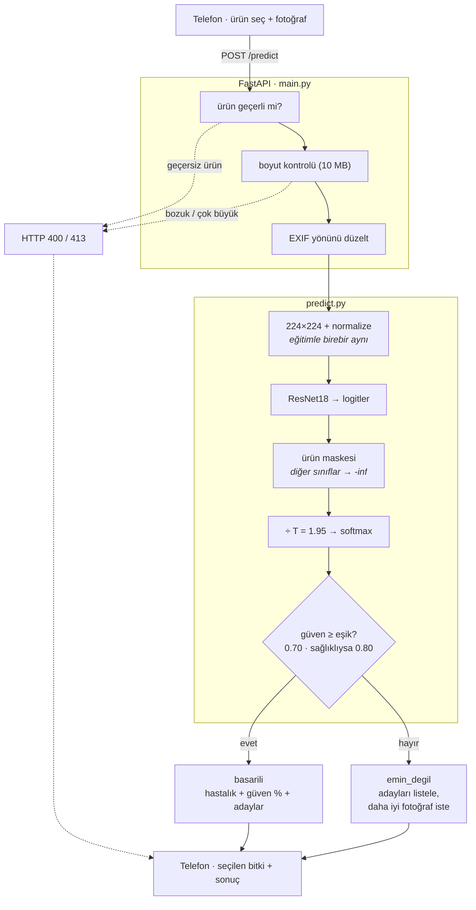

<div align="center">

<h1>Bitki Hastalığı Tespiti</h1>

<p>
  <b>
    Yaprak fotoğrafından domates, patates ve biber hastalıklarını tanımaya<br>
    çalışan, <i>sınırlarını bilen</i> bir karar-destek sistemi.
  </b>
</p>

<p>
  <a href="https://github.com/yusufsmnc/bitki-hastalik-tespiti/actions/workflows/ci.yml"></a>
  
  
  
  
</p>

<p>
  Laboratuvar <b>%97.64</b> <sub>(PlantVillage val)</sub>
  &nbsp;·&nbsp;
  <b>Saha %69.77</b> <sub>(PlantDoc, ürün maskeli)</sub>
  &nbsp;·&nbsp;
  3 ürün, 15 sınıf
  &nbsp;·&nbsp;
  emin değilse susar
</p>

</div>

Hedef kullanım: tarladaki bir çiftçi telefonuyla yaprağın fotoğrafını çeker,
sistem olası hastalığı ve ne kadar emin olduğunu söyler. Emin değilse bunu
açıkça söyler ve daha iyi bir fotoğraf ister.

<details>
<summary><b>İçindekiler</b></summary>

- [📊 Önce dürüst tablo](#-önce-dürüst-tablo)
- [✅ Neyi başardık](#-neyi-başardık)
- [📚 Veri setleri](#-veri-setleri)
- [🧠 Model](#-model)
- [🌿 Tanınan sınıflar (15)](#-tanınan-sınıflar-15)
- [🔧 Kurulum](#-kurulum)
- [🔌 API](#-api)
- [🔄 Nasıl çalışır](#-nasıl-çalışır)
- [📁 Proje yapısı](#-proje-yapısı)
- [🧪 Testler](#-testler)
- [🧭 Yol haritası](#-yol-haritası)
- [🧰 Teknolojiler](#-teknolojiler)
- [📄 Lisans ve kullanım](#-lisans-ve-kullanım)

</details>

---

## 📊 Önce dürüst tablo

Bu bölüm başta duruyor, çünkü projeyi değerlendirirken ilk bilmeniz gereken şey
bu. Bitki hastalığı tespiti literatüründe "%99 doğruluk" iddiaları yaygındır ve
neredeyse hepsi **laboratuvar** rakamıdır. Bu projede ikisini de ölçtük:

Aşağıdaki tüm sayılar `best_model_v3_durust.pth` modeline aittir ve her birinin
yanında hangi veri setinde ölçüldüğü yazılıdır.

| Ortam | Top-1 |
|---|---:|
| Laboratuvar — PlantVillage val, 3.089 görüntü (seçimde kullanılmadı) | %97.64 |
| **Gerçek tarla, ürün maskesi olmadan** — PlantDoc test, 569 görüntü | **%57.64** |
| **Gerçek tarla, ürün maskeli** — aynı PlantDoc test, 569 görüntü | **%69.77** |

Aradaki bu uçurum bir hata değil, bu alanın bilinen ve zor problemi:
laboratuvarda öğrenilen şey tarlada aynı işe yaramıyor. **Bu projenin asıl
rakamı saha rakamıdır.** Herhangi bir yerde "%99 doğrulukla hastalık tespiti"
ifadesi görürseniz, o ifade yanlıştır.

### Ürün maskesi: çiftçi ne ektiğini biliyor

Sistem kullanıcıya ürünü sorar (domates / patates / biber) ve seçilen ürünün
dışındaki sınıfları softmax'tan **önce** eler. Model 15 sınıf arasından değil,
o ürünün sınıfları arasından seçim yapar. PlantDoc test seti, 569 görüntü:

| Ölçüm | Maskesiz | Ürün maskeli |
|---|---:|---:|
| Top-1 | %57.64 | %69.77 |
| Top-3 | %86.47 | %93.85 |
| Makro F1 | 0.593 | 0.702 |

> [!IMPORTANT]
> **Maskeli sayılar literatürdeki maskesiz sonuçlarla kıyaslanamaz.** Modele
> dışarıdan bir bilgi (hangi ürün) veriliyor; bu, problemi kolaylaştırır.
> Kıyaslamak isteyen maskesiz kolona bakmalı. Maskeli sayıların tamamı
> **çiftçinin ürünü doğru seçtiği** varsayımına dayanır — yanlış seçimin
> sonucu [Sınırlar](#sınırlar) bölümünde.

### Kalibrasyon: güven skoru artık bir şey ifade ediyor

Eğitilmiş ağlar tipik olarak aşırı özgüvenlidir: "%95 eminim" dediğinde
%95 isabet etmez. Logitler softmax'tan önce `T = 1.95`'e bölünerek bu
bastırıldı. Tahmini **değiştirmez**, yalnızca güven skorunu gerçeğe yaklaştırır.
PlantDoc test seti, 569 görüntü:

| | Kalibrasyon öncesi | Kalibrasyon sonrası |
|---|---:|---:|
| ECE (kalibrasyon hatası, düşük = iyi) | 15.41 | 5.17 |
| Ortalama güven | %85.2 | %72.0 |
| Gerçek doğruluk | %69.8 | %69.8 |

Yani sistem eskiden ortalama %85 eminim derken %69.8 isabet ediyordu; şimdi
%72 eminim diyor ve yine %69.8 isabet ediyor.

### Karar kuralı: emin değilse susar

Kalibre edilmiş olasılık **0.70**'in altındaysa sistem kesin cevap vermez,
"bu yaprağı net tanıyamadım" der ve en olası 3 adayı listeler. Tahmin bir
*sağlıklı* sınıfsa eşik daha sıkıdır: **0.80**. PlantDoc test seti, 569 görüntü:

| Sonuç | Oran | İsabet |
|---|---:|---:|
| Kesin cevap verdi | %54.5 | %88.1 |
| → bunlardan "sağlıklı" diyenler (n=36) | — | %83.3 |
| "Emin değilim" dedi | %45.5 | doğru cevap ilk 3 adayın içinde: %88.4 |

Bedeli açıkça kabul ediyoruz: **fotoğrafların %45.5'inde sistem kesin cevap
vermiyor.** Bu bir kusur değil, bilinçli bir takas — yanlış yönlendirmektense
susmak. Susarken de tamamen susmuyor: adayların içinde doğru cevabın bulunma
oranı %88.4, yani liste çiftçiye yine iş görüyor.

> [!NOTE]
> **Eşiğin 0.95'ten 0.70'e düşmesi bir gevşetme değildir.** Ölçekler farklı:
> eski 0.95 kalibre edilmemiş (aşırı özgüvenli) olasılıklar üzerindeydi, yeni
> 0.70 ise `T` ile bastırılmış olasılıklar üzerinde. İki sayı doğrudan
> karşılaştırılamaz. Eski kuralın kaydı
> [yol haritası belgesinde](docs/model-yol-haritasi.md) duruyor.

### Sınırlar

Yukarıdaki sayılar şu sınırlar içinde geçerlidir:

- **Yanlış ürün seçimi en büyük risk.** Test görüntüleri bilerek yanlış ürünle
  değerlendirildiğinde (n=1.138) sistem **%55.3** oranında *emin görünen yanlış*
  bir cevap üretti — maske doğru sınıfı kestiği için olasılık kalan sınıflara
  dağılıyor ve güven yüksek çıkıyor. Buna karşı iki önlem var. Arayüz: seçilen
  bitki her sonuçta gösterilir, ürün değiştirildiğinde fotoğraf kendiliğinden
  yeniden gönderilmez. **Otomatik kontrol (artık sistemde):** maskeden önceki
  T-ölçekli softmax'ta seçilen ürünün payı `0.20`'nin altındaysa "bu fotoğraf
  seçtiğiniz bitkiye benzemiyor" uyarısı verilir; yakalama %82.8, yanlış alarm
  %4.6, ve emin görünen yanlış cevap oranı **%55.3 → %7.5**'e düşer (test, 569).
  Uyarı sonucu **engellemez**, yalnızca sorar.
- **Uyarının yanlış alarmı biberde daha sık.** Genel yanlış alarm %4.6 ürüne
  göre dağılıyor (test, doğru ürün seçildiğinde): domates %1.6, patates %7.2,
  **biber %17.6** (n=51, kesin değil). Ürün payı sınıf sayısından etkilendiği
  için 2 sınıflı biber tek eşikte dezavantajlı — **biber seçildiğinde bu uyarı
  daha sık çıkar.** Sınıf sayısına göre düzeltme yol haritasında (Aşama 2).
- **Eşik seçimi gürültülü.** `T = 1.95` ve 0.70 eşiği, PlantDoc eğitim
  bölümünden ayrılmış **163 görüntülük** ayrı bir saha val setinde seçildi
  (test setiyle phash karşılaştırılıp kopyaları temizlendi). 569'luk test seti
  seçimde kullanılmadı, yalnızca raporlama için bir kez kullanıldı. 163 görüntü
  az; eşik biraz farklı bir val setiyle biraz farklı çıkabilirdi.
- **0.80 "sağlıklı" eşiği veriyle ayarlanmadı.** Bilinçli bir güvenlik kararı:
  hastalıklı yaprağa "sağlıklı" demek tedaviyi geciktirir. Val setindeki
  "sağlıklı" tahmin sayısı (5–17) ayrı bir eşik ayarlamaya yetmiyordu.
- **Test etiketlerinin bir kısmı gürültülü.** Aynı fotoğrafın farklı veri
  setlerinde farklı etiketlerle bulunduğu 40 çift tespit edildi (domates/patates
  karışıklığı dahil). Yani gerçek doğruluk, ölçülen sayıdan hem yukarı hem aşağı
  sapabilir.
- **Tek test seti.** Tüm saha sayıları aynı 569 görüntülük PlantDoc bölümünden
  geliyor. Başka bir bölgede, başka bir telefonla çekilmiş fotoğraflarda ne
  olacağı ölçülmedi.
- **Laboratuvar val'i bir test bölümü değil.** PlantVillage val'i (3.089) hiçbir
  seçimde kullanılmadı, ama modelin epoch'u (8) saha val setinde seçildi.

> [!TIP]
> Sürüm sürüm ayrıntılı karşılaştırma tablosu (v3 → v4 → backbone yarışması)
> **Faz 4'te güncellenecek**; şimdilik aşama aşama kayıt
> [yol haritası belgesinde](docs/model-yol-haritasi.md) tutuluyor.

### Bu sistem ne DEĞİL

- **Teşhis aracı değil.** Kesin tanı için ziraat mühendisine danışılmalı.
- **Genel amaçlı bitki tanıyıcı değil.** Sadece 3 ürün ve 15 sınıf biliyor.
  Bir fasulye yaprağı gösterirseniz model bunu "bilmiyorum" diye reddedemez;
  seçtiğiniz ürünün sınıflarından birine benzetmeye çalışır. Tek koruma güven
  eşiğidir.
- **Tarla koşullarında güvenilir değil.** Yukarıdaki tablolara bakın.

---

## ✅ Neyi başardık

Projenin bu noktaya kadar çözdüğü somut problemler:

- **Laboratuvar–tarla uçurumunu görünür kıldık.** Üç veri setini (biri
  laboratuvar, ikisi gerçek tarla) birleştirip modeli ikisinde de ölçtük.
  Çoğu örnek projenin atladığı adım bu.
- **Ölçümü dürüst hale getirdik.** Checkpoint seçimi artık test setine değil
  ayrı bir saha val setine bakıyor; eğitim verisiyle test seti arasındaki
  kopyalar phash ile tarandı. Bulgular yeniden ölçüme zorladı —
  ayrıntısı [yol haritasında](docs/model-yol-haritasi.md).
- **Güven skorunu kalibre ettik.** Sıcaklık ölçekleme ve eşikler, test setinden
  ayrı bir saha val setinde seçildi; test seti yalnızca bir kez raporlandı.
- **Sistemi "bilmiyorum" diyebilir hale getirdik** ve susarken de boş
  bırakmadık: en olası 3 adayı listeliyor.
- **Uçtan uca çalışan bir zincir kurduk:** model → Python API → telefon
  uyumlu web arayüzü. Fotoğraf çekmekten sonucu görmeye kadar her adım çalışıyor.
- **Model dosyası olmadan çalışan test altyapısı yazdık.** Model git'te yok
  (~43 MB), ama CI yine de her push'ta 77 testi çalıştırıyor.
- **Sonuçları abartmadan raporladık.** Yukarıdaki tablolar ve
  [Sınırlar](#sınırlar) bölümü bunun kanıtı.

---

## 📚 Veri setleri

Model üç ayrı veri setinin birleşimiyle eğitildi. Bu birleştirme projenin
merkezindeki fikir: tek başına laboratuvar verisi tarlada işe yaramıyor.

| Veri seti | Tür | Rolü |
|---|---|---|
| **PlantVillage** | Laboratuvar | Temiz, bol örnekli taban. Düz zeminde tek yaprak. |
| **PlantDoc** | Gerçek tarla | Dağınık arka plan, doğal ışık. Eşik ayarı ve saha ölçümleri bu setin **ayrı** bölümleriyle yapıldı (val 163 / test 569). |
| **PlantWild** | Gerçek tarla | Ek tarla çeşitliliği. |

### Lisans uyarısı

> [!WARNING]
> **PlantWild veri seti CC-BY-NC-ND lisanslıdır: ticari kullanım yasaktır.**
>
> Bu model PlantWild verisiyle eğitildiği için, eğitilmiş ağırlıklar da bu
> kısıtın etkisi altındadır. Projeyi ticari bir ürüne dönüştürmeyi
> düşünüyorsanız modeli PlantWild olmadan yeniden eğitmeniz gerekir.

Diğer veri setlerinin lisans koşulları için kendi kaynaklarına bakın; bu
depoda veri seti dosyası bulunmuyor.

---

## 🧠 Model

- **Mimari:** ResNet18 (torchvision)
- **Yöntem:** Transfer learning + fine-tuning
- **Çerçeve:** PyTorch
- **Çıktı katmanı:** 15 sınıf
- **Çıkarım (inference):** CPU. GPU gerekmez — tahmin saniyeler değil,
  milisaniyeler sürüyor.

> [!NOTE]
> Eğitim bu depoda yapılmıyor. Depo yalnızca *eğitilmiş modeli
> kullanan* servisi içerir; eğitim script'i burada yok.
> `best_model_v3_durust.pth` (~43 MB) boyutu nedeniyle git'e dahil edilmedi
> (bkz. [Kurulum](#-kurulum)). İki küçük künye dosyası ise depoda:
> `class_names.json` (sınıf adları) ve `model_config.json` (model dosya adı,
> sıcaklık, iki eşik).

### Model künyesi: `model_config.json`

Sıcaklık ve eşikler kodun değil **modelin** özelliğidir; üçü de bu belirli
ağırlık dosyası üzerinde ölçüldü. Bu yüzden kodun içine gömülmek yerine
model dosyasının yanında, ayrı bir künye dosyasında duruyorlar:

```json
{ "model_dosyasi": "...", "sicaklik": 1.95, "guven_esigi": 0.70, "saglikli_esigi": 0.80 }
```

> [!CAUTION]
> Yeni bir model eğitilirse bu üç sayı da **yeniden ölçülmelidir.** Eski
> değerleri yeni ağırlıklarla kullanmak, sistemin kalibre olduğunu sanarak
> kalibre olmayan güven skorları göstermesine yol açar.

### Ön işlemede kritik kural

Tahmin sırasındaki görüntü ön işlemesi, eğitimdekiyle **birebir** aynı olmak
zorundadır:

```python
transforms.Resize((224, 224))
transforms.Normalize([0.485, 0.456, 0.406], [0.229, 0.224, 0.225])
```

> [!CAUTION]
> Bu değerler farklı olursa model gözle görülür bir hata vermeden saçmalar —
> en sık yapılan deploy hatasıdır. Bu yüzden değerleri bir test sabitliyor
> (`tests/test_predict.py::test_on_isleme_egitimdekiyle_ayni_kalmali`).

---

## 🌿 Tanınan sınıflar (15)

Model sınıf adlarını İngilizce (PlantVillage adlandırması) üretir; arayüzde
Türkçe karşılıkları gösterilir.

| Ürün | Sınıf | Kapsam |
|---|---:|---|
| Domates | 10 | sağlıklı + 9 hastalık |
| Patates | 3 | sağlıklı + 2 hastalık |
| Biber | 2 | sağlıklı + 1 hastalık |

<details>
<summary><b>15 sınıfın tam listesi (model çıktısındaki adlarla)</b></summary>

| Ürün | Sınıf | Türkçe |
|---|---|---|
| Biber | `Pepper__bell___Bacterial_spot` | Biber - Bakteriyel leke |
| Biber | `Pepper__bell___healthy` | Biber - Sağlıklı |
| Patates | `Potato___Early_blight` | Patates - Erken yanıklık |
| Patates | `Potato___Late_blight` | Patates - Geç yanıklık (mildiyö) |
| Patates | `Potato___healthy` | Patates - Sağlıklı |
| Domates | `Tomato_Bacterial_spot` | Domates - Bakteriyel leke |
| Domates | `Tomato_Early_blight` | Domates - Erken yanıklık |
| Domates | `Tomato_Late_blight` | Domates - Geç yanıklık (mildiyö) |
| Domates | `Tomato_Leaf_Mold` | Domates - Yaprak küfü |
| Domates | `Tomato_Septoria_leaf_spot` | Domates - Septoria yaprak lekesi |
| Domates | `Tomato_Spider_mites_Two_spotted_spider_mite` | Domates - Kırmızı örümcek |
| Domates | `Tomato__Target_Spot` | Domates - Hedef leke |
| Domates | `Tomato__Tomato_YellowLeaf__Curl_Virus` | Domates - Sarı yaprak kıvırcıklık virüsü |
| Domates | `Tomato__Tomato_mosaic_virus` | Domates - Mozaik virüsü |
| Domates | `Tomato_healthy` | Domates - Sağlıklı |

</details>

Listede olmayan bir sınıf adı gelirse (örn. model değişirse) uygulama
çökmez, ham İngilizce adı gösterir.

---

## 🔧 Kurulum

### Gereksinimler

- Python 3.14 (CI bu sürümle çalışıyor; 3.11+ muhtemelen sorunsuzdur)
- Model dosyası: `best_model_v3_durust.pth` (künye dosyaları depoda zaten var)

### 1. Model dosyasını edinin

**`best_model_v3_durust.pth` git deposunda yoktur** — ~43 MB olduğu için
`.gitignore`'dadır. Dosyayı proje sahibinden edinip `bitki-backend/`
klasörünün içine koyun. Yanındaki iki künye dosyası depoyla birlikte gelir:

```
bitki-backend/
├── best_model_v3_durust.pth    (siz koyacaksınız)
├── class_names.json            (depoda var)
└── model_config.json           (depoda var)
```

Hangi dosyanın yükleneceğini `model_config.json` içindeki `model_dosyasi`
alanı söyler; dosya adı değişirse orayı güncellemek yeterlidir.

> [!WARNING]
> `class_names.json`'daki sınıf sırası, modelin eğitildiği sırayla birebir
> aynı olmalı. Yeni bir model gelirse bu dosya da onunla birlikte güncellenir;
> aksi halde model doğru tahmin eder ama ekranda yanlış hastalık adı görünür.

### 2. Sanal ortam ve bağımlılıklar

```bash
cd bitki-backend
python -m venv venv

# Windows (PowerShell):
.\venv\Scripts\Activate.ps1
# macOS / Linux:
source venv/bin/activate

pip install -r ../requirements.txt
```

CPU'da çalıştırmak yeterli olduğu için PyTorch'un CPU sürümü de kullanılabilir;
bu, ~2 GB'lık CUDA paketlerini indirmekten kurtarır:

```bash
pip install torch==2.14.0 torchvision==0.29.0 \
  --index-url https://download.pytorch.org/whl/cpu
```

### 3. Sunucuyu başlatın

```bash
# bitki-backend/ klasöründeyken:
uvicorn main:app --reload
```

`main:app` komutu `main.py`'yi *import ederek* bulur, bu yüzden komutun
`bitki-backend/` içinden çalıştırılması gerekir. `--reload` yalnızca
geliştirme içindir.

Arayüz: **http://127.0.0.1:8000**

Arayüzde ilk adım **bitki seçimi** (domates / patates / biber); seçim
yapılmadan fotoğraf düğmesi açılmaz. Seçilen bitki her sonuç kartında
görünür — yanlış seçim en olası kullanıcı hatası ve farkedilmesinin yolu
bu satır. Bitkiyi değiştirirseniz fotoğraf kendiliğinden yeniden
gönderilmez, önce size sorulur.

### Telefondan erişim

Aynı Wi-Fi ağındaki telefondan test etmek için sunucuyu tüm arayüzlere açın:

```bash
uvicorn main:app --host 0.0.0.0
```

Bilgisayarın yerel IP'sini öğrenip (`ipconfig` / `ifconfig`) telefonda
`http://192.168.x.x:8000` adresini açın. Güvenlik duvarı ilk seferde izin
isteyebilir.

---

## 🔌 API

| Adres | Yöntem | Açıklama |
|---|---|---|
| `/` | GET | Telefon uyumlu web arayüzü |
| `/health` | GET | Sunucu ayakta mı — `{"durum": "calisiyor"}` |
| `/predict` | POST | Fotoğraf yükle, tahmin al |
| `/docs` | GET | FastAPI'nin otomatik ürettiği API arayüzü |
| `/static/...` | GET | Arayüz dosyaları |

### `/predict` kullanımı

**İki form alanı da zorunludur:** `file` (resim) ve `urun`
(`domates` / `patates` / `biber`).

```bash
curl -X POST \
  -F "file=@yaprak.jpg" \
  -F "urun=domates" \
  http://127.0.0.1:8000/predict
```

> [!IMPORTANT]
> `urun` opsiyonel değildir ve olmayacaktır. Sıcaklık ve eşikler yalnızca
> **ürün maskesi uygulanmış** çıktılar üzerinde ölçüldü; maskesiz bir yol
> açmak bu sayıları geçersiz kılar ve sistem kalibre olmadığı hâlde kalibre
> güven skorları göstermeye başlar.

Kalibre edilmiş güven eşiği geçiyorsa (0.70; tahmin *sağlıklı* bir sınıfsa
0.80) — *aşağıdaki iki örnekteki sayılar cevabın **biçimini** göstermek için
yazılmış temsilî değerlerdir, ölçüm değildir; gerçek ölçümler
[Önce dürüst tablo](#-önce-dürüst-tablo) bölümünde:*

```json
{
  "durum": "basarili",
  "urun": "domates",
  "hastalik": "Tomato_Leaf_Mold",
  "hastalik_tr": "Domates - Yaprak küfü",
  "guven": 91.4,
  "adaylar": [
    { "hastalik": "Tomato_Leaf_Mold", "hastalik_tr": "Domates - Yaprak küfü", "guven": 91.4 },
    { "hastalik": "Tomato_Early_blight", "hastalik_tr": "Domates - Erken yanıklık", "guven": 4.1 },
    { "hastalik": "Tomato_healthy", "hastalik_tr": "Domates - Sağlıklı", "guven": 1.8 }
  ]
}
```

Emin değilse:

```json
{
  "durum": "emin_degil",
  "urun": "domates",
  "mesaj": "Bu yaprağı net tanıyamadım. Daha yakın ve net bir fotoğraf çeker misiniz?",
  "en_yakin_tahmin": "Tomato_Leaf_Mold",
  "en_yakin_tahmin_tr": "Domates - Yaprak küfü",
  "guven": 64.1,
  "adaylar": [ "...en olası en fazla 3 sınıf..." ]
}
```

Alanlarla ilgili iki tasarım kararı:

- **`adaylar`** her iki durumda da döner; en olası *en fazla* 3 sınıf. Maskelenen
  sınıflar listeye girmez, bu yüzden biberde (2 sınıf) 2 aday döner. `guven`
  birimi diğer `guven` alanıyla aynı: yüzde, 1 ondalık.
- **`en_yakin_tahmin` alanları arayüzde bilerek gösterilmez.** Sistem
  "tanıyamadım" dedikten sonra *tek* bir tahmin fısıldarsa kullanıcı onu cevap
  sanar; liste ise belirsizliği açıkça gösterir. Arayüz `adaylar`'ı gösterir.

### Hata kodları

| Kod | Anlamı |
|:---:|---|
| 400 | Dosya okunabilir bir resim değil (bozuk, yarım veya resim olmayan) |
| 400 | `urun` geçersiz (örn. `elma`) — okunur bir Türkçe `detail` metniyle |
| 413 | Dosya 10 MB sınırını aşıyor |
| 422 | `file` veya `urun` alanı hiç gönderilmemiş |

Geçersiz ürün için FastAPI'nin otomatik 422'si yerine elle 400 döndürülüyor:
422'nin `detail` alanı bir *liste*dir, arayüz ise kullanıcıya gösterebileceği
okunur bir *metin* bekliyor.

Hatalar Türkçe bir `detail` alanıyla döner; arayüz bu metni doğrudan
kullanıcıya gösterir.

---

## 🔄 Nasıl çalışır



Tasarımın önemli ayrıntıları:

1. **Maske softmax'tan ÖNCE uygulanır.** Sonra uygulansaydı kesilen sınıfların
   olasılığı pay toplamına girer, kalan olasılıklar 1'e toplanmaz ve güven
   skorları ölçülen değerlerle uyumsuz olurdu.
2. **Ürün kontrolü dosya okunmadan önce yapılır.** 8 MB'lık bir fotoğrafı
   belleğe alıp sonra "ürün yanlış" demek boşa iş.
3. **Model uygulama başlarken bir kere yüklenir**, her istekte değil. Her
   istekte yüklemek tahmini saniyelerce yavaşlatırdı.
4. **EXIF yönü düzeltilir.** Telefonlar fotoğrafı döndürmek yerine dosyaya
   "bu resim dönük" etiketi yazar. Uygulanmazsa model yan yatmış bir yaprak görür.
5. **`/predict` `async def` değil, düz `def`.** Tahmin CPU'yu meşgul eden
   senkron bir iş; `async` içinde olsaydı tahmin bitene kadar sunucu başka
   hiçbir isteğe cevap veremezdi.

---

## 📁 Proje yapısı

```
bitki-hastalik-tespiti/
├── README.md
├── requirements.txt            uygulama bağımlılıkları
├── requirements-dev.txt        pytest, httpx
├── pytest.ini
├── docs/model-yol-haritasi.md  model eğitimi yol haritası
├── .github/workflows/ci.yml    8 aşamalı CI boru hattı
├── tests/
│   ├── conftest.py             CI için sahte model üretir
│   ├── test_predict.py         tahmin fonksiyonu + güven eşiği
│   ├── test_kalibrasyon.py     ürün maskesi, sıcaklık, iki eşik
│   ├── test_main.py            endpoint'ler (TestClient ile)
│   ├── test_sozlesme.py        arayüz ↔ backend alan adları
│   └── test_e2e.py             gerçek uvicorn sunucusuyla uçtan uca
└── bitki-backend/
    ├── main.py                 FastAPI uygulaması
    ├── predict.py              model yükleme + tahmin
    ├── tune_threshold.py       ESKİ kurala göre ölçer (tarihsel)
    ├── static/index.html       telefon uyumlu arayüz
    ├── best_model_v3_durust.pth  (git'te YOK)
    ├── class_names.json        sınıf adları (modelle eşleşmeli)
    └── model_config.json       sıcaklık ve iki eşik
```

---

## 🧪 Testler

```bash
pip install -r requirements-dev.txt

pytest                  # 77 test
pytest -m "not e2e"     # 63 hızlı test
pytest -m e2e           # 14 uçtan uca test (gerçek sunucu başlatır)
```

Testler **gerçek modele bağlı değildir.** `tests/conftest.py` aynı mimaride
(ResNet18, aynı sınıf sayısı) rastgele ağırlıklı sahte bir model üretip
ortam değişkenleriyle `predict.py`'ye gösterir. Ölçülen şey modelin isabeti
değil — rastgele ağırlıkla bu zaten ölçülemez — kodun doğru çalışmasıdır.

Her test dosyası ayrı bir soruyu yanıtlar:

| Dosya | Soru |
|---|---|
| `test_predict.py` | Tahmin fonksiyonu sözleşmeye uyuyor mu? Eşik mantığı doğru mu? |
| `test_kalibrasyon.py` | Maske softmax'tan önce mi uygulanıyor? Sıcaklık ve iki eşik doğru mu işliyor? |
| `test_main.py` | Endpoint'ler doğru kodları ve gövdeleri döndürüyor mu? |
| `test_sozlesme.py` | Arayüzün okuduğu alanlar backend'in gönderdikleriyle uyuşuyor mu? |
| `test_e2e.py` | Uygulama gerçekten ayağa kalkıyor ve ağ üzerinden cevap veriyor mu? |

### CI

Her push ve pull request'te GitHub Actions 8 aşamayı çalıştırır: depo
hijyeni denetimi (model/venv/cache yanlışlıkla commit'lenmiş mi), bağımlılık
kurulumu, hızlı testler, sonra uçtan uca testler. Tipik süre ~1 dakika.

---

## 🧭 Yol haritası

> [!TIP]
> Model eğitiminin aşama aşama ayrıntılı planı (ölçüm, yeni veri, backbone
> yarışması, lezyon denetimi, damıtma) ayrı bir belgede:
> **[Model Geliştirme Yol Haritası](docs/model-yol-haritasi.md)**

Önceliklendirilmiş liste — üsttekiler projenin güvenilirliği için daha kritik.

### 1. Eşiği dürüst biçimde yeniden ölç — ✅ yapıldı

Eski eşik, isabet rakamlarının ölçüldüğü *aynı* test setine bakılarak
seçilmişti. Artık sıcaklık ve eşikler 163 görüntülük **ayrı** bir saha val
setinde seçiliyor; 569'luk test seti yalnızca bir kez raporlandı. Kayıt:
[yol haritası, Aşama 0–1](docs/model-yol-haritasi.md).

### 1b. Ürün tutarlılık kontrolü — ✅ yapıldı

Yanlış ürün seçimi en büyük risk ([Sınırlar](#sınırlar)). Maskeden önceki
T-ölçekli softmax'ta seçilen ürünün payı `0.20`'nin altındaysa sistem artık
uyarıyor (sonucu engellemeden). Emin görünen yanlış cevap oranı %55.3 → %7.5.
Yanlış alarm ürüne göre değişiyor (biber %17.6, n=51); sınıf sayısına göre
düzeltme Aşama 2'de. Kayıt: [yol haritası](docs/model-yol-haritasi.md).

### 2. Kapsam dışı yaprakları reddet

Model şu an 15 sınıftan birini seçmek *zorunda*. Bir fasulye yaprağı
gösterildiğinde "bu benim bilmediğim bir şey" diyemiyor; tek koruma güven
eşiği ve bu yeterli değil. Yapılabilecekler: eğitime "diğer/bilinmeyen"
sınıfı eklemek, out-of-distribution tespiti, ya da önce "bu bir yaprak mı"
diye bakan ikinci bir model.

### 3. Tarla doğruluğunu yükselt (ürün maskeli %69.77 → ?)

Asıl darboğaz bu. Denenebilecekler: daha agresif veri artırma (augmentation)
— arka plan değiştirme, gölge/bulanıklık ekleme; daha fazla gerçek tarla
verisi; daha güçlü bir omurga (ResNet50, EfficientNet); yaprağı arka plandan
ayıran bir ön adım (segmentasyon).

<details>
<summary><b>Daha uzun vadeli maddeler (4–7)</b></summary>

### 4. Daha fazla ürün ve hastalık

Şu an 3 ürün var. Türkiye'de yaygın diğer ürünler (buğday, mısır, üzüm,
elma) eklenebilir. Her yeni ürün yeni veri ve yeniden eğitim demek.

### 5. Kullanıcı deneyimi

- ~~İlk 3 tahmini güvenleriyle göstermek (tek cevap yerine)~~ — ✅ yapıldı
  (`adaylar`, "emin değilim" durumunda)
- Tespit edilen hastalık için kısa bilgi ve mücadele önerisi
- Çevrimdışı çalışma (PWA) — tarlada internet zayıf olabilir
- Fotoğraf çekerken canlı yönlendirme ("yaprağa yaklaş", "gölgeden çık")

### 6. Dağıtım (Faz 5)

Hugging Face Spaces / Render / Railway üzerine kurulum. Yapılması gerekenler:
model dosyasını platforma ayrıca yüklemek (git'te yok) ve **CORS'u
kısıtlamak** — şu an `allow_origins=["*"]` geliştirme ayarıdır, production'da
yalnızca kendi alan adına izin verilmeli.

### 7. Saha testi

Hiçbir rakam, gerçek bir çiftçinin gerçek tarlada çektiği fotoğrafın yerini
tutmaz. Küçük bir kullanıcı grubuyla saha denemesi ve geri bildirim toplama.

</details>

---

## 🧰 Teknolojiler

| Katman | Seçim | Neden |
|---|---|---|
| Model | PyTorch + torchvision | Model PyTorch'ta eğitildi |
| API | FastAPI | Python (modelle aynı dil), otomatik `/docs`, ML'de fiili standart |
| Sunucu | Uvicorn | FastAPI'nin standart ASGI sunucusu |
| Görüntü | Pillow | EXIF düzeltme ve format dönüşümü |
| Arayüz | Tek dosya HTML/CSS/JS | Çerçeve yok; tarlada hızlı açılması önemli |
| Test | pytest + httpx | — |
| CI | GitHub Actions | — |

Backend'in Python olması bilinçli bir tercih: model PyTorch'ta olduğu için
servis de Python olunca model ile arasında hiçbir çeviri katmanı gerekmiyor.

---

## 📄 Lisans ve kullanım

Bu depodaki **kod** eğitim amaçlıdır. Ancak eğitilmiş model, CC-BY-NC-ND
lisanslı PlantWild verisiyle eğitildiği için **ticari kullanıma kapalıdır**
(bkz. [Lisans uyarısı](#lisans-uyarısı)).

> [!CAUTION]
> Sistemin verdiği sonuçlar bir ön değerlendirmedir, kesin tanı değildir.
> Tarımsal karar almadan önce bir ziraat uzmanına danışın.
