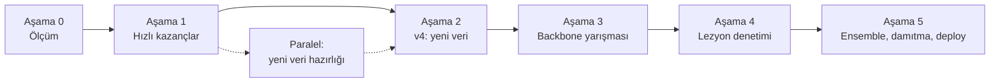

# Model Geliştirme Yol Haritası

Hedef: modeli gerçek tarlada kullanılabilir hale getirmek.
Başlangıç noktası **v3** (ResNet18, PlantVillage + PlantDoc + PlantWild): PlantDoc saha test setinde **%62.21 top-1**.

Yol haritası altı aşamadan oluşur. Önce ölçüm dürüst hale getirilir, sonra eğitim gerektirmeyen kazançlar toplanır, ardından her seferinde tek değişken değiştirilerek veri, backbone ve lezyon denetimi eklenir. Her aşamanın sonunda bir **kapı** vardır; kapıdan geçmeyen fikir bir sonraki aşamaya taşınmaz.

> **Lisans notu:** PlantWild ve PlantSeg CC BY-NC-ND 4.0 lisanslıdır. Bu verilerle eğitilen model ticari olarak kullanılamaz; proje öğrenme ve portfolyo amaçlıdır.

| Aşama | İş | Kapı |
| --- | --- | --- |
| 0 | Val ayır, sızıntı kontrolü, dürüst v3 ölçümü | Güvenilir başlangıç sayısı |
| 1 | Eğitimsiz kazançlar + Grad-CAM *(paralelde: yeni veri hazırlığı)* | Aşama 4 önceliği belirlendi, kalibre eşik `predict.py`'de |
| 2 | v4 = ResNet18 + yeni veri, v3 ile kıyas | v4, v3'ü geçer |
| 3 | Backbone yarışması (genişletilmiş veriyle) | Kazanan, v4'ü anlamlı farkla geçer |
| 4 | Lezyon denetimi (PlantSeg maskeleri) | Kazanç + Grad-CAM odağı lezyona kayar |
| 5 | Ensemble, damıtma, deploy | CPU'da 1 sn altı, saha doğruluğu v3'ün üstünde |

---

## Temel kurallar

1. **Tek değişken.** Her deneyde yalnızca bir şey değişir (veri, backbone veya kayıp fonksiyonu). Aynı `seed=42`, aynı bölmeler, aynı epoch bütçesi.
2. **Test setine en son bakılır.** 569'luk PlantDoc saha test seti dokunulmazdır. Checkpoint seçimi, scheduler ve eşik ayarı saha val setiyle yapılır; test seti her model için bir kere, en sonda kullanılır.
3. **Her yeni görüntü phash'ten geçer.** Eğitime giren her görüntü, test ve val setine karşı `imagehash.phash` ile taranır; eşleşenler atılır.
4. **Remap kontrolü.** Her yeni kaynak 15'lik master şemaya eşlenir; sadece temiz eşlemeler alınır. Yanlış etiket, eksik etiketten daha zararlıdır.
5. **Ön işleme eşitliği.** Backbone her değiştiğinde `predict.py` içindeki ön işleme, eğitimdeki `eval_transform` ile birebir eşleştirilir.
6. **Dürüst raporlama.** Her sonuç top-1, top-3 ve sınıf bazlı f1 ile raporlanır; olumsuz sonuçlar da yazılır.

---

## Aşama 0 — Ölçümü sağlamlaştır

Amaç: v3 için güvenilir bir başlangıç sayısı. Eğitim yok.

- [ ] 838'lik PlantDoc eğitim setinden sınıf bazlı %20 saha val seti ayır (sabit seed, dosya listesi olarak kaydet)
- [ ] Eğitim kodunda checkpoint seçimi ve scheduler'ın hangi sete baktığını kontrol et; test setine bakıyorsa val setine çevir
- [ ] PlantWild eğitim görüntülerini 569'luk test setine karşı phash ile tara, eşleşme sayısını kaydet
- [ ] Eşleşme varsa: eşleşenleri çıkarıp v3'ü aynı hiperparametrelerle yeniden eğit (v3-temiz)
- [ ] v3 (veya v3-temiz) için top-1, top-3, karışıklık matrisi ve sınıf bazlı f1 çıkar

**Çıktı:** `split_saha_val.json`, `phash_rapor.csv`, `olcum_v3.md`
**Kapı:** Dürüst v3 sayısı belgelendi ve val/test ayrımı kodda garanti altında.

## Aşama 1 — Eğitimsiz kazançlar ve teşhis

Amaç: v3'ü yeniden eğitmeden daha kullanışlı hale getirmek ve hataların nereden geldiğini görmek.

- [ ] Ürün seçimi + logit maskeleme: seçilen ürünün dışındaki sınıflara `-inf` ekle; maskeli ve maskesiz doğruluğu kıyasla
- [ ] Grad-CAM: test setinden 20-30 yanlış tahminin ısı haritası; her birini "arka plan / yaprakta yanlış bölge / doğru lezyon, yanlış sınıf" olarak etiketle
- [ ] Kalibrasyon: saha val setinde temperature scaling
- [ ] `tune_threshold.py`: farklı eşiklerde isabet/kapsama tablosu, `GUVEN_ESIGI` güncellemesi
- [ ] TTA: 4-5 augment'li kopyanın softmax ortalaması
- [ ] Soru soran model (prototip): en çok karışan sınıf çiftlerinden 5-6 soruluk belirti havuzu, bilgi kazancıyla soru seçimi, Bayes güncellemesi
- [ ] Soru soran modeli simüle et: çiftçi cevabını gerçek sınıftan üret, %20 ihtimalle yanlış cevap ver; 1 ve 2 soru sonrası doğruluğu ölç
- [ ] `P(cevap | hastalık)` tablosunu bir ziraat mühendisine veya güvenilir bitki patolojisi kaynağına doğrulat

**Paralel iş:** yeni veri hazırlığı (Aşama 2'nin hazırlık kısmı).
**Kapı:** Grad-CAM sonucuna göre Aşama 4'ün önceliği belirlendi; kalibre edilmiş eşik `predict.py`'ye işlendi.

## Aşama 2 — v4: yeni veri ile ResNet18

Amaç: yeni saha verisinin etkisini mimariden bağımsız ölçmek. Değişen tek şey veri.

Hazırlık (Aşama 1 ile paralel):

- [ ] Her seti indir, 20-30 örneğe gözle bak
- [ ] Eşleme tablosu yaz; sadece temiz eşlemeleri al
- [ ] Remap uygula
- [ ] phash ile test ve val setine karşı tara, eşleşenleri at
- [ ] Setler arası tekrarları at (özellikle PlantSeg ve PlantWild)
- [ ] PlantSeg maskelerini Aşama 4 için ayrı klasörde sakla

Eğitim:

- [ ] `WeightedRandomSampler` kaynak ağırlıklarını yeni setleri ayrı kaynak sayacak şekilde güncelle
- [ ] v4'ü eğit, v3 ile kıyasla
- [ ] Sonuç şaşırtıcıysa setleri tek tek çıkararak sorunlu kaynağı bul

| Veri seti | İçerik | Bizim için | Lisans | Dikkat |
| --- | --- | --- | --- | --- |
| [PlantSeg](https://github.com/tqwei05/PlantSeg) | 11.400+ saha görüntüsü, 115 hastalık, lezyon maskeleri | Sınıflandırma verisi + Aşama 4 maskeleri | [CC BY-NC-ND 4.0](https://zenodo.org/records/13762907) | PlantDoc/PlantWild ile çakışabilir |
| [FieldPlant](https://universe.roboflow.com/plant-disease-detection/fieldplant) | Kamerun tarlaları, 5.170 görüntü (mısır, manyok, domates) | Domates saha verisi | Roboflow sürümü CC BY 4.0 görünüyor, doğrula | Nesne tespiti seti: yaprakları kutulardan kırp |
| [Endonezya patates seti](https://data.mendeley.com/datasets/ptz377bwb8/1) | 3.076 telefon fotoğrafı, 7 sınıf | Late_blight, Potato___healthy | Sayfada doğrula | Sadece phytophthora → Late_blight ve healthy → healthy |
| [Etiyopya patates seti](https://data.mendeley.com/datasets/v4w72bsts5/1) | 63 geç yanıklık + 363 sağlıklı | Potato___healthy saha boşluğu | Sayfada doğrula | Küçük ve dengesiz |
| Kendi saha fotoğrafların | Hedef bölgeden | Gerçek deployment test seti | Senin | Eğitime değil teste ayır |

**Çıktı:** `veri_esleme.md`, `best_model_v4.pth`, v3–v4 kıyas tablosu
**Kapı:** v4, v3'ü saha val ve test setinde geçer.

## Aşama 3 — Backbone yarışması

Amaç: genişletilmiş veride en iyi önceden eğitilmiş backbone'u bulmak (Colab Pro). Sıfırdan eğitim yok.

Adım 1 — Linear probe:

- [ ] Her aday için backbone donuk, özellikleri bir kere çıkar ve kaydet
- [ ] Üstüne lojistik regresyon eğit, saha val setinde kıyasla
- [ ] Adaylar: DINOv3 ViT-L/16, BioCLIP 2, DINOv2 ViT-L/14, referans ResNet18

Adım 2 — Kazananı tam fine-tune:

- [ ] Daha yüksek çözünürlük (384-448)
- [ ] Katmana göre azalan öğrenme oranı (LLRD) veya LoRA; `AdamW`; bf16
- [ ] İki aşamalı eğitim korunur
- [ ] Kazananın ön işlemesini not et

**Çıktı:** linear probe sonuç tablosu, `best_model_v5.pth`
**Kapı:** Kazanan, v4'ü saha val setinde anlamlı farkla geçer.
