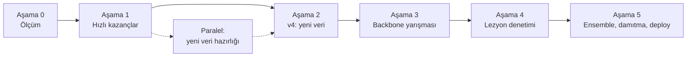

# Model Geliştirme Yol Haritası

Hedef: modeli gerçek tarlada kullanılabilir hale getirmek.
Başlangıç noktası **v3** (ResNet18, PlantVillage + PlantDoc + PlantWild): PlantDoc saha test setinde **%62.21 top-1**.

> **Bu başlangıç sayısı güvenilmez çıktı.** Aşama 0, %62.21'in test setine bakılarak seçilmiş bir checkpoint'ten geldiğini ve test setinin bir kısmının eğitim verisinde kopyası bulunduğunu gösterdi. Dürüst yeniden ölçüm **v3-dürüst** satırındadır (maskesiz %57.64). Ayrıntı: [Aşama 0 bulguları](#aşama-0--ölçümü-sağlamlaştır).

Yol haritası altı aşamadan oluşur. Önce ölçüm dürüst hale getirilir, sonra eğitim gerektirmeyen kazançlar toplanır, ardından her seferinde tek değişken değiştirilerek veri, backbone ve lezyon denetimi eklenir. Her aşamanın sonunda bir **kapı** vardır; kapıdan geçmeyen fikir bir sonraki aşamaya taşınmaz.

> **Lisans notu:** PlantWild ve PlantSeg CC BY-NC-ND 4.0 lisanslıdır. Bu verilerle eğitilen model ticari olarak kullanılamaz; proje öğrenme ve portfolyo amaçlıdır.

| Aşama | İş | Kapı |
| --- | --- | --- |
| 0 ✅ | Val ayır, sızıntı kontrolü, dürüst v3 ölçümü | Güvenilir başlangıç sayısı |
| 1 (kısmen) | Eğitimsiz kazançlar + Grad-CAM *(paralelde: yeni veri hazırlığı)* | Aşama 4 önceliği belirlendi, kalibre eşik `predict.py`'de |
| 2 | v4 = ResNet18 + yeni veri, v3 ile kıyas | v4, v3'ü geçer |
| 3 | Backbone yarışması (genişletilmiş veriyle) | Kazanan, v4'ü anlamlı farkla geçer |
| 4 | Lezyon denetimi (PlantSeg maskeleri) | Kazanç + Grad-CAM odağı lezyona kayar |
| 5 | Ensemble, damıtma, deploy | CPU'da 1 sn altı, saha doğruluğu v3'ün üstünde |

---

## Temel kurallar

1. **Tek değişken.** Her deneyde yalnızca bir şey değişir (veri, backbone veya kayıp fonksiyonu). Aynı `seed=42`, aynı bölmeler, aynı epoch bütçesi.
2. **Test setine en son bakılır.** 569'luk PlantDoc saha test seti dokunulmazdır. Checkpoint seçimi, scheduler ve eşik ayarı saha val setiyle yapılır; test seti her model için bir kere, en sonda kullanılır.
3. **Her yeni görüntü phash'ten geçer.** Eğitime giren her görüntü, test ve val setine karşı `imagehash.phash` ile taranır; eşleşenler atılır.
4. **Remap kontrolü.** Her yeni kaynak 15'lik master şemaya eşlenir; sadece temiz eşlemeler alınır. Yanlış etiket, eksik etiketten daha zararlıdır.
5. **Ön işleme eşitliği.** Backbone her değiştiğinde `predict.py` içindeki ön işleme, eğitimdeki `eval_transform` ile birebir eşleştirilir.
6. **Dürüst raporlama.** Her sonuç top-1, top-3 ve sınıf bazlı f1 ile raporlanır; olumsuz sonuçlar da yazılır.

---

## Aşama 0 — Ölçümü sağlamlaştır

Amaç: v3 için güvenilir bir başlangıç sayısı. Eğitim yok. **Durum: tamamlandı.**

- [x] 838'lik PlantDoc eğitim setinden sınıf bazlı %20 saha val seti ayır (sabit seed, dosya listesi olarak kaydet) — 163 görüntü
- [x] Eğitim kodunda checkpoint seçimi ve scheduler'ın hangi sete baktığını kontrol et; test setine bakıyorsa val setine çevir
- [x] PlantWild eğitim görüntülerini 569'luk test setine karşı phash ile tara, eşleşme sayısını kaydet
- [x] Eşleşme varsa: eşleşenleri çıkarıp v3'ü aynı hiperparametrelerle yeniden eğit (v3-dürüst)
- [x] v3 (veya v3-dürüst) için top-1, top-3, karışıklık matrisi ve sınıf bazlı f1 çıkar

### Bulgular

Hepsi eski **v3** ile ilgilidir ve yeniden ölçümü zorunlu kıldı:

- **Checkpoint seçimi test setine bakıyordu.** %62.21, seçimde kullanılan setin kendisinde ölçülmüş bir sayıydı; yani bir test sonucu değil, iyimser bir üst sınır.
- **Eğitim–test sızıntısı.** Test setinin en az **82 görüntüsünün** (%14.4) kopyası eski v3'ün eğitim verisindeydi (`imagehash.phash`, mesafe ≤ 10). Eski v3, kopyalardan arındırılmış **487 görüntüde %61.81** top-1 yaptı — sızıntı tek başına sayıyı şişirmemiş, ama sayının temiz bir ölçüm olmadığını gösterdi.
- **Etiket gürültüsü.** Aynı fotoğrafın farklı veri setlerinde **farklı etiketlerle** bulunduğu 40 çift tespit edildi; domates/patates karışıklığı dahil. Test etiketlerinin bir kısmı gürültülüdür, yani ölçülen doğruluk iki yöne de sapabilir.
- **Laboratuvar görüntüsü saha setinin içinde.** PlantDoc test/val bölümünde **10 PlantVillage** (laboratuvar) görüntüsü bulundu; bu kadarlık bir kirlilik saha sayısını hafifçe yukarı çeker.

**Çıktı:** `split_saha_val.json`, `phash_rapor.csv`, `olcum_v3.md`
**Kapı:** ✅ Dürüst v3 sayısı belgelendi ve val/test ayrımı kodda garanti altında.

## Aşama 1 — Eğitimsiz kazançlar ve teşhis

Amaç: v3'ü yeniden eğitmeden daha kullanışlı hale getirmek ve hataların nereden geldiğini görmek.

- [x] Ürün seçimi + logit maskeleme: seçilen ürünün dışındaki sınıflara `-inf` ekle; maskeli ve maskesiz doğruluğu kıyasla — top-1 %57.64 → %69.77 (PlantDoc test, 569)
- [x] Kalibrasyon: saha val setinde temperature scaling — `T = 1.95`; test setinde ECE 15.41 → 5.17
- [x] Güven eşiği: saha val setinde seçildi — 0.70, "sağlıklı" tahminler için 0.80 *(0.80 veriyle değil güvenlik gerekçesiyle)*
- [x] Backend'e taşı: `predict.py` + `main.py` + arayüz; üç sayı `model_config.json`'a alındı
- [x] Ürün tutarlılık kontrolü: **eklendi** (`predict.py` → `urun_uyarisi`, arayüzde sonuç kartının üstünde uyarı). Eşik `urun_esigi = 0.20`, saha val'da seçildi (yakalama %85.6, yanlış alarm %4.3); test (569): yakalama %82.8, yanlış alarm %4.6, yanlış ürünle emin görünen yanlış cevap %55.3 → %7.5. Yanlış alarm ürüne göre değişiyor (test, doğru ürün seçildiğinde): domates (10 sınıf) n=365 %1.6, patates (3 sınıf) n=153 %7.2, biber (2 sınıf) n=51 %17.6 — biber oranı 51 görüntüden, kesin değil. Ürün payı sınıf sayısından etkilendiği için 2 sınıflı biber tek eşikte dezavantajlı (bkz. Aşama 2 düzeltme maddesi).
- [ ] Grad-CAM: test setinden 20-30 yanlış tahminin ısı haritası; her birini "arka plan / yaprakta yanlış bölge / doğru lezyon, yanlış sınıf" olarak etiketle
- [ ] TTA: 4-5 augment'li kopyanın softmax ortalaması
- [ ] Soru soran model (prototip): en çok karışan sınıf çiftlerinden 5-6 soruluk belirti havuzu, bilgi kazancıyla soru seçimi, Bayes güncellemesi
- [ ] Soru soran modeli simüle et: çiftçi cevabını gerçek sınıftan üret, %20 ihtimalle yanlış cevap ver; 1 ve 2 soru sonrası doğruluğu ölç
- [ ] `P(cevap | hastalık)` tablosunu bir ziraat mühendisine veya güvenilir bitki patolojisi kaynağına doğrulat

### Neden ürün tutarlılık kontrolü gerekiyor

Maske, seçilen ürünün dışındaki sınıfları kestiği için **yanlış ürün seçimi sessiz kalmıyor, emin görünen yanlış bir cevap üretiyor**: olasılık her zaman izin verilen sınıflara dağıtılıyor ve güven yüksek çıkıyor. Test görüntüleri bilerek yanlış ürünle değerlendirildiğinde (n=1.138) bu oran **%55.3**. Arayüz önlemi (seçilen bitki her sonuçta görünür, ürün değişince fotoğraf kendiliğinden gönderilmez) yerinde duruyor; artık buna **ölçülmüş otomatik kontrol** eklendi: maskeden önceki T-ölçekli softmax'ta seçilen ürünün payı `0.20`'nin altındaysa uyarı veriliyor ve emin görünen yanlış cevap oranı **%55.3 → %7.5**'e düşüyor.

Yanlış alarm oranı ürüne göre belirgin biçimde değişiyor (test, doğru ürün seçildiğinde): domates %1.6 (n=365), patates %7.2 (n=153), **biber %17.6 (n=51)**. Sebep: ürün payı, ürünün sınıf sayısından etkilenir — model kararsız kaldığında olasılık 15 sınıfa yayılır ve 2 sınıflı biberin payı doğal olarak küçük kalır, bu yüzden tek eşik biberi dezavantajlı duruma düşürür. Biber oranı 51 görüntüden geldiği için kesin değil ama domatesle fark belirgin. **Neden şimdilik tek eşik:** saha val setinde sadece 15 biber görüntüsü var; ürüne özel eşik ayarlamaya yetmez. Uyarı sonucu engellemiyor, yalnızca "doğru bitkiyi mi seçtin?" diye soruyor; o yüzden fazla alarm bile güvenliği bozmuyor, sadece biber kullanıcısına daha sık soruyor.

**Paralel iş:** yeni veri hazırlığı (Aşama 2'nin hazırlık kısmı).
**Kapı:** Kalibre edilmiş eşik `predict.py`'ye işlendi ✅; Grad-CAM ile Aşama 4 önceliğinin belirlenmesi bekliyor.

## Aşama 2 — v4: yeni veri ile ResNet18

Amaç: yeni saha verisinin etkisini mimariden bağımsız ölçmek. Değişen tek şey veri.

Hazırlık (Aşama 1 ile paralel):

- [ ] Her seti indir, 20-30 örneğe gözle bak
- [ ] Eşleme tablosu yaz; sadece temiz eşlemeleri al
- [ ] Remap uygula
- [ ] phash ile test ve val setine karşı tara, eşleşenleri at
- [ ] Setler arası tekrarları at (özellikle PlantSeg ve PlantWild)
- [ ] PlantSeg maskelerini Aşama 4 için ayrı klasörde sakla

Eğitim:

- [ ] `WeightedRandomSampler` kaynak ağırlıklarını yeni setleri ayrı kaynak sayacak şekilde güncelle
- [ ] v4'ü eğit, v3 ile kıyasla
- [ ] Sonuç şaşırtıcıysa setleri tek tek çıkararak sorunlu kaynağı bul
- [ ] Ürün tutarlılık kontrolünü sınıf sayısına göre düzelt (ürüne özel eşik veya normalize edilmiş pay); yeni saha verisiyle biber örnekleri arttıktan sonra val'da ölç

| Veri seti | İçerik | Bizim için | Lisans | Dikkat |
| --- | --- | --- | --- | --- |
| [PlantSeg](https://github.com/tqwei05/PlantSeg) | 11.400+ saha görüntüsü, 115 hastalık, lezyon maskeleri | Sınıflandırma verisi + Aşama 4 maskeleri | [CC BY-NC-ND 4.0](https://zenodo.org/records/13762907) | PlantDoc/PlantWild ile çakışabilir |
| [FieldPlant](https://universe.roboflow.com/plant-disease-detection/fieldplant) | Kamerun tarlaları, 5.170 görüntü (mısır, manyok, domates) | Domates saha verisi | Roboflow sürümü CC BY 4.0 görünüyor, doğrula | Nesne tespiti seti: yaprakları kutulardan kırp |
| [Endonezya patates seti](https://data.mendeley.com/datasets/ptz377bwb8/1) | 3.076 telefon fotoğrafı, 7 sınıf | Late_blight, Potato___healthy | Sayfada doğrula | Sadece phytophthora → Late_blight ve healthy → healthy |
| [Etiyopya patates seti](https://data.mendeley.com/datasets/v4w72bsts5/1) | 63 geç yanıklık + 363 sağlıklı | Potato___healthy saha boşluğu | Sayfada doğrula | Küçük ve dengesiz |
| Kendi saha fotoğrafların | Hedef bölgeden | Gerçek deployment test seti | Senin | Eğitime değil teste ayır |

**Çıktı:** `veri_esleme.md`, `best_model_v4.pth`, v3–v4 kıyas tablosu
**Kapı:** v4, v3'ü saha val ve test setinde geçer.

## Aşama 3 — Backbone yarışması

Amaç: genişletilmiş veride en iyi önceden eğitilmiş backbone'u bulmak (Colab Pro). Sıfırdan eğitim yok.

Adım 1 — Linear probe:

- [ ] Her aday için backbone donuk, özellikleri bir kere çıkar ve kaydet
- [ ] Üstüne lojistik regresyon eğit, saha val setinde kıyasla
- [ ] Adaylar: DINOv3 ViT-L/16, BioCLIP 2, DINOv2 ViT-L/14, referans ResNet18

Adım 2 — Kazananı tam fine-tune:

- [ ] Daha yüksek çözünürlük (384-448)
- [ ] Katmana göre azalan öğrenme oranı (LLRD) veya LoRA; `AdamW`; bf16
- [ ] İki aşamalı eğitim korunur
- [ ] Kazananın ön işlemesini not et

**Çıktı:** linear probe sonuç tablosu, `best_model_v5.pth`
**Kapı:** Kazanan, v4'ü saha val setinde anlamlı farkla geçer.

## Aşama 4 — Lezyon ve arka plan denetimi

Amaç: modeli arka plana değil hastalıklı bölgeye baktırmak. Öncelik Aşama 1'deki Grad-CAM sayımına göre belirlenir.

| Grad-CAM bulgusu | Öncelikli deney |
| --- | --- |
| Isı çoğunlukla arka planda | Yaprak maskesi veya arka plan değiştirme + tutarlılık kaybı |
| Isı yaprakta ama lezyonu kaçırıyor | Çok görevli öğrenme (PlantSeg maskeleri) + yüksek çözünürlük |
| Isı doğru lezyonda, sınıf yanlış | Düşük öncelik; güçlü backbone ve hedef saha verisi daha etkili |

- [ ] Çok görevli öğrenme: segmentasyon başı ekle; kayıp = sınıflandırma + λ × segmentasyon
- [ ] Arka plan değiştirme: PlantVillage yapraklarını kes, gerçek tarla arka planlarına yapıştır
- [ ] Tutarlılık kaybı: aynı yaprak iki farklı arka planda; tahminler arasındaki farkı cezalandır
- [ ] Her deneyden sonra aynı hatalı örneklerin Grad-CAM'ini tekrar çıkar

Literatür notu: arka plan değiştirme yayınlanmış bir yöntemdir ([Lab-to-Field](https://www.sciencedirect.com/science/article/pii/S1574954125005886)); tutarlılık kaybı ile birleşimi bu projenin kendi hipotezi olarak raporlanır.

**Kapı:** En az bir deney saha val setinde kazanç getirir ve Grad-CAM'de odak lezyona kayar.

## Aşama 5 — Ensemble, damıtma, deploy

- [ ] Öğretmen: farklı ailelerden iki model (CNN + ViT) ensemble
- [ ] Öğrenci: küçük model (örneğin DINOv3 ConvNeXt-Tiny) öğretmenden damıtılır
- [ ] CPU'da tek görüntü tahmin süresini ölç (hedef: 1 saniyenin altı)
- [ ] Öğrenciyi kalibre et, eşiği yeniden ayarla
- [ ] `predict.py`: yeni model, yeni ön işleme, ürün maskesi, soru soran mod
- [ ] Arayüz: ürün seçimi butonu ve soru akışı
- [ ] README: tüm sürümlerin dürüst sonuç tablosu ve olumsuz bulgular
- [ ] 569'luk test setinde tek, son ölçüm

**Kapı:** Öğrenci CPU hedefini tutturur ve saha doğruluğu v3'ün üstündedir.

---

## Eski karar kuralı (tarihsel kayıt)

Aşama 1'den önce sistem şu kuralı kullanıyordu: **ürün maskesi yok, sıcaklık ölçekleme yok, ham softmax olasılığına 0.95 eşiği.** Tablo, o dönemin `predict.py` dosyasındaki yorumdan alınmıştır (commit `0ce0369`); PlantDoc test setinde 569 görüntü üzerinde `tune_threshold.py` ile ölçülmüştü:

| Güven eşiği | Kapsama (cevap verdiği oran) | Cevap verdiğinde isabet |
| ---: | ---: | ---: |
| 0.80 | %58.3 | %73.8 |
| 0.90 | %45.0 | %80.1 |
| **0.95 (seçilen)** | **%36.6** | **%84.6** |
| 0.97 | %30.2 | %87.8 |

Seçim kuralı o zaman şöyle yazılmıştı: *isabetin ~%85'e ulaştığı en düşük eşik.* Modelin eşiksiz genel doğruluğu aynı sette %62.2 olarak kaydedilmişti.

Bu kuralın iki sorunu vardı:

1. **Eşik, raporlandığı aynı test setinde seçildi.** Yani %84.6 isabet bir test sonucu değil, iyimser bir üst sınırdı. (Uyarı o zaman da kodda yazılıydı.)
2. **Olasılıklar kalibre edilmemiş ve maskesizdi.** 0.95 aşırı özgüvenli bir dağılımın üzerine konmuş bir eşikti; bu yüzden fotoğrafların ~%63'ünde sistem susmak zorunda kalıyordu.

Yeni kuralın 0.70 eşiği bununla **doğrudan karşılaştırılamaz**: ölçek farklı (logitler `T = 1.95`'e bölünmüş) ve maske uygulanmış. İki sayıyı yan yana koyup "eşik gevşetildi" demek yanlış olur.

`tune_threshold.py` dosyası depoda duruyor ama **eski kurala göre ölçer** (maske ve sıcaklık uygulamaz); güncel eşik ayarı Colab'daki Aşama 1 notebook'unda yapılıyor.

---

## Sonuç tablosu

Saha val her deneyde, test seti sadece aşama kapılarında doldurulur.

| Sürüm | Değişen tek şey | Saha val top-1 (%) | Saha test top-1 (%) | Top-3 test (%) | Makro f1 (test) | CPU süresi (ms) | Not |
| --- | --- | --- | --- | --- | --- | --- | --- |
| v3 | Başlangıç | — | 62.21 | | | | **Güvenilmez.** Checkpoint test setine bakılarak seçilmiş; test setinin %14.4'ü (≥82 görüntü) eğitimde kopya. Kopyasız 487 görüntüde %61.81. Saha val boş: **val görüntüleri eğitimdeydi** |
| v3-dürüst | Checkpoint saha val'de seçildi (epoch 8) | 67.48 | 57.64 | 86.47 | 0.593 | | Maskesiz. Laboratuvar (PlantVillage val, 3.089, seçimde kullanılmadı): %97.64 |
| v3-dürüst + maske | Ürün seçimi (maske softmax'tan **önce**) | 77.91 | 69.77 | 93.85 | 0.702 | | Çiftçinin ürünü doğru seçtiği varsayımıyla. Literatürdeki maskesiz sonuçlarla kıyaslanamaz |
| v3-dürüst + maske + kalibrasyon | `T = 1.95` | 77.91 *(değişmez)* | 69.77 *(değişmez)* | 93.85 | 0.702 | | Sıcaklık sıralamayı bozmaz, yalnızca güveni kalibre eder: test ECE 15.41 → 5.17, ortalama güven %85.2 → %72.0. Karar kuralı (0.70 / sağlıklı 0.80): kapsama %54.5, isabet %88.1 |
| + TTA | Çıkarım | | | | | | Henüz ölçülmedi |
| v3 + soru (1 soru) | Etkileşim | | | | | | Simülasyon, %20 cevap hatası |
| v4 | Yeni veri | | | | | | |
| v5 | Backbone | | | | | | |
| v6 | Lezyon denetimi | | | | | | |
| Öğrenci | Damıtma | | | | | | |

> **Saha val top-1 iyimserdir.** Maskesiz %67.48, modelin epoch'unun (8) seçilmesinde kullanılan değerin kendisidir. Testteki %57.64 ile arasındaki 9.8 puanlık farkın bir kısmı bu seçim etkisinden kaynaklanır; tamamını "val kolay, test zor" diye okumak yanlış olur.

### Saha val (163 görüntü) ayrıntısı

| Sürüm | Top-1 (%) | Top-3 (%) | Makro F1 | Kalibrasyon |
| --- | ---: | ---: | ---: | --- |
| v3-dürüst (maskesiz) | 67.48 | 90.18 | 0.638 | |
| v3-dürüst + maske | 77.91 | 95.09 | 0.723 | ECE 14.61 |
| + kalibrasyon (`T = 1.95`) | 77.91 *(değişmez)* | 95.09 | 0.723 | ECE 10.96 |

`T` bu val setinde seçildi, bu yüzden val'daki ECE kazancı (14.61 → 10.96) testteki kazançtan (15.41 → 5.17) **daha küçük** — ters görünüyor ama şaşırtıcı değil: tek bir sıcaklık değeri iki setteki hatayı aynı oranda düzeltmek zorunda değil. Raporlanacak sayı testtekidir.

## Riskler

| Risk | Etki | Önlem |
| --- | --- | --- |
| Yanlış ürün seçimi | Emin görünen yanlış cevap (yanlış ürünle n=1.138'de %55.3) | Arayüz (seçilen bitki her sonuçta görünür, ürün değişince sorulur) **+ ölçülmüş otomatik kontrol** (`urun_esigi = 0.20`): emin görünen yanlış cevap %55.3 → %7.5. Yanlış alarm biberde yüksek (%17.6, n=51); sınıf sayısına göre düzeltme Aşama 2'de |
| Veri setleri arası çakışma | Doğruluk şişer | Her kaynakta phash taraması |
| Yanlış remap | Model sessizce yanlış öğrenir | Eşleme tablosu + örneklere gözle bakış |
| Soru tablosundaki olasılıklar uydurma | Soru soran mod yanlış yönlendirir | Uzman veya kaynak doğrulaması |
| Büyük modelin CPU'da yavaş kalması | Çiftçi bekler | Damıtma |
| PlantDoc dışı saha koşulları | Gerçek bölgede doğruluk düşük kalır | Kendi saha test fotoğrafları |

## Gelecek fikirler

- **Hava durumu önseli:** fotoğrafın yer ve tarihindeki sıcaklık/nem bilgisiyle hastalık riskini birleştirmek.
- **Çoklu çekim:** yaprağın ön yüzü, arka yüzü ve bitkinin geneli birlikte değerlendirilir.
- **Aktif öğrenme döngüsü:** deploy sonrası düşük güvenli fotoğraflar (kullanıcı onayıyla) etiketlenip eğitime katılır.
